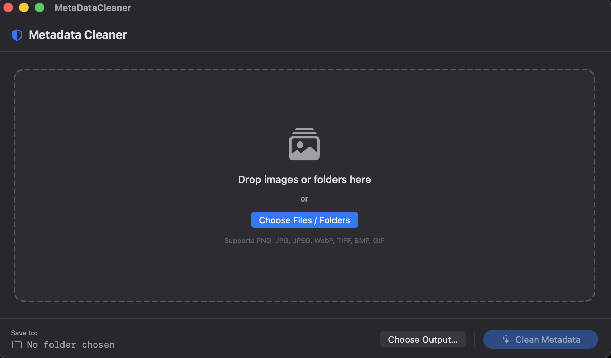
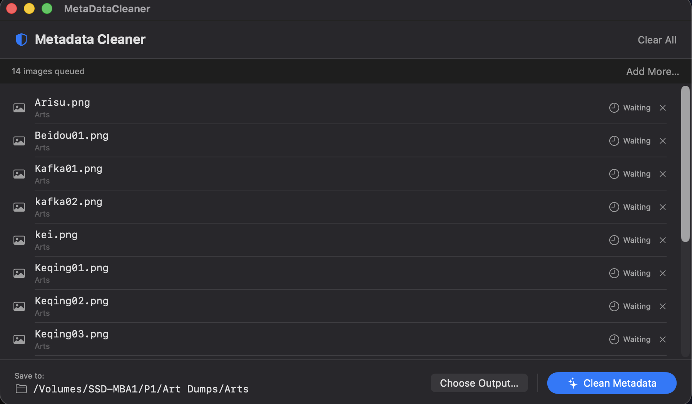

# MetaDataCleaner

A lightweight native macOS app that **bulk strips all metadata** from images — EXIF, PNG text chunks (Prompts, seeds, model names), XMP, IPTC — and saves cleaned copies with randomized filenames to a folder of your choice.

Built with SwiftUI using Apple's `CGImageSource` / `CGImageDestination` APIs. No internet connection. No telemetry. Everything stays on your machine.

---

## Screenshots

<p align="center">
  
  <br/><em>Drop images or folders, or use the file picker</em>
</p>

<p align="center">
  
  <br/><em>15 images queued, output folder selected, ready to clean</em>
</p>

---

## Features

- **Drag & drop** images or entire folders onto the window
- **Bulk processing** — queue hundreds of images at once
- **Randomized output filenames** — 16-character alphanumeric names so cleaned files can never be linked back to originals
- **Per-file status** — live Waiting → Processing → Cleaned / Error feedback for each file
- **Choose any output folder** — cleaned images are never saved over originals
- **No duplicate collisions** — random names are regenerated if a clash is found
- **Fully offline** — no network access, no accounts, no cloud

### What gets removed

| Metadata type | Examples |
|---|---|
| PNG text chunks | NovelAI `parameters`, `Comment`, seed, model |
| EXIF | Camera model, GPS location, timestamps |
| XMP | Adobe editing history, ratings, labels |
| IPTC | Copyright, author, keywords |

### Supported formats

`PNG` `JPG` `JPEG` `WebP` `TIFF` `BMP` `GIF`

---

## Installation

### Option A — Run the pre-built app (easiest)

1. Download or clone this repository
2. Open `MetaDataCleaner/` in Finder
3. Double-click **`MetaDataCleaner.app`**
4. If macOS shows *"app can't be opened because it's from an unidentified developer"*:
   - Right-click the app → **Open** → **Open** (only needed the first time)
   - Or go to **System Settings → Privacy & Security → Open Anyway**

### Option B — Build from source with Xcode

**Requirements:** macOS 14+, Xcode 15+

```bash
git clone https://github.com/YOUR_USERNAME/MetaDataCleaner.git
cd MetaDataCleaner
open MetaDataCleaner/MetaDataCleaner.xcodeproj
```

Press **⌘R** in Xcode to build and run.

### Option C — Build from command line (no Xcode IDE needed)

**Requirements:** macOS 14+, Xcode Command Line Tools (`xcode-select --install`)

```bash
git clone https://github.com/YOUR_USERNAME/MetaDataCleaner.git
cd MetaDataCleaner

swiftc MetaDataCleaner/MetaDataCleaner/*.swift \
  -sdk $(xcrun --show-sdk-path --sdk macosx) \
  -target arm64-apple-macosx14.0 \
  -framework SwiftUI \
  -framework AppKit \
  -framework ImageIO \
  -framework UniformTypeIdentifiers \
  -o MetaDataCleaner.app/Contents/MacOS/MetaDataCleaner

open MetaDataCleaner.app
```

---

## Usage

1. **Add images** — drag & drop files or folders onto the window, or click **Choose Files / Folders**
2. **Set output folder** — click **Choose Output…** and pick where cleaned images should be saved
3. **Clean** — click **Clean Metadata**. Each file shows live status. When done, click **Open Output Folder**

Your original files are never modified.

---

## Why randomized filenames?

Sites like NovelAI can use your image's original filename combined with metadata to trace back generation parameters. Randomized names sever that link entirely — each cleaned file gets a fresh 16-character random alphanumeric name (e.g. `k3mx9azqpw1r5fty.png`).

---

## Tech stack

| | |
|---|---|
| Language | Swift 5.9 |
| UI | SwiftUI |
| Image I/O | `ImageIO` framework (`CGImageSource` / `CGImageDestination`) |
| Platform | macOS 14 Sonoma+ |

---

## License

MIT — do whatever you want with it.
